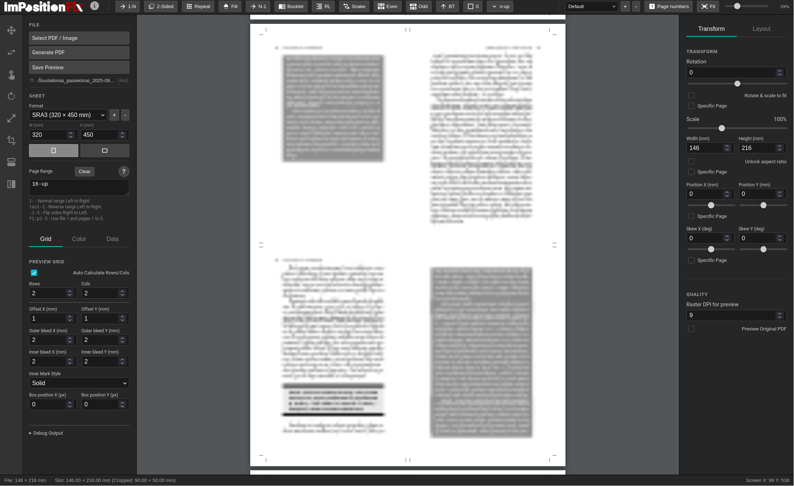
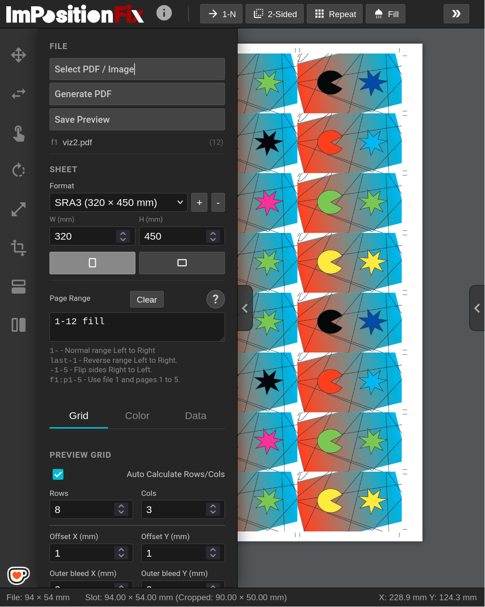

# ImpositionFix

This program is made to help with PDF or images imposition tasks for print production in way using smple command feauture by typing in "Page Range" field. 

You can test and use it here:
https://mazu-tirazu-spaustuve.eu/impositionfix/

## Features

- Cropmarks are added acutomatically which position can be adjusted
- Inner Mark
- It allows adjusting and transforming pages individually or set of them
- Adding paper formats
- Saving some of layout functions for repeating similar jobs later
- Toolbox
- Generate PDF
- Generate as raster preview which DPI can be set manually
- Bleed adjust
- Grid adjust
- Color adjust for preview export only
- Numbering with prefixes
- Color bars (incomplete)
- Duplex marks (incomplete)
- Preview pages as numbers
- Swapping pages, rows or columns

## Commands

- repeat: Repeat pages to fill sheets
- 2sided, 2sided(1-3): 2-sided imposition (LR, RL)
- last-1: Reverse page order
- 4-up, 8-up...: Split booklet into N-page signatures
- booklet: Booklet imposition
- snake: Snake layout
- odd, even: Filter pages
- b(...): Bottom-up layout
- -(...): Right-to-Left layout

## Screenshots

