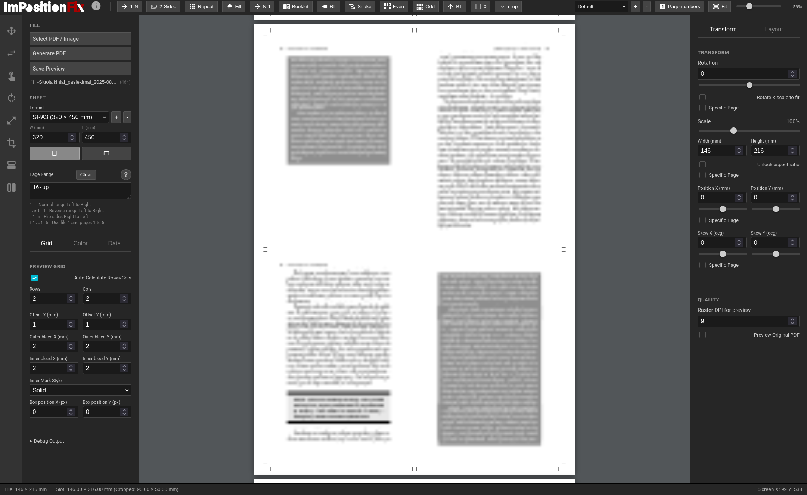
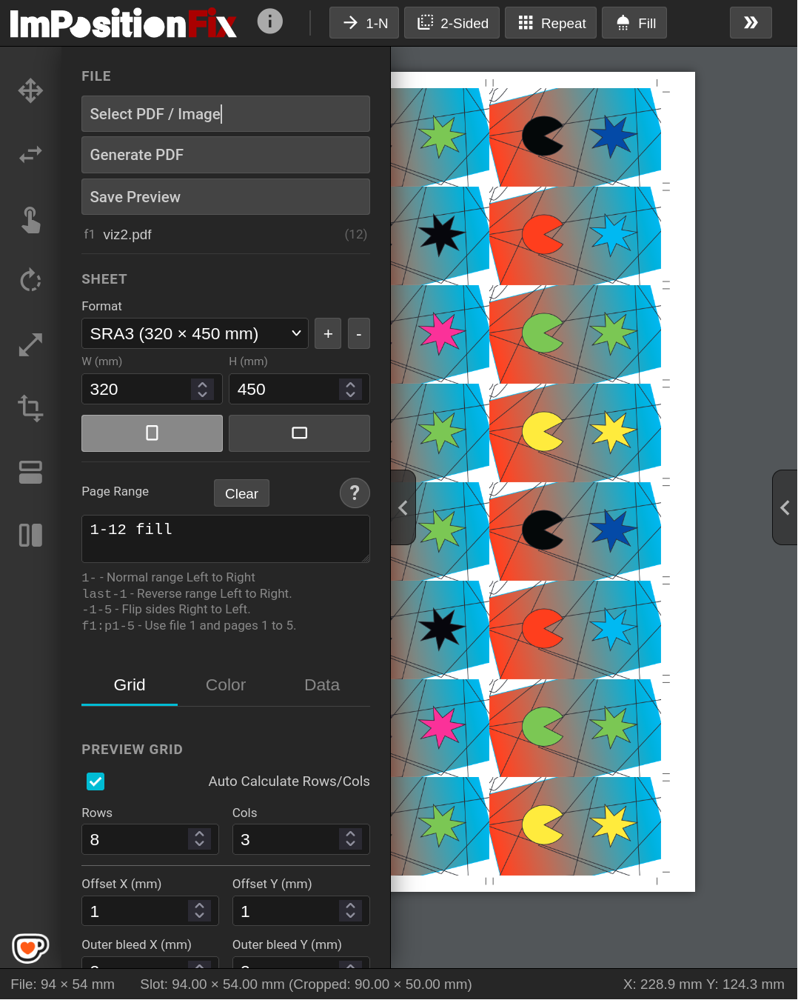

# ImpositionFix

This program is made to help with PDF or images imposition tasks for print production in way using smple command feauture by typing in "Page Range" field. 

You can test and use it here:
https://mazu-tirazu-spaustuve.eu/impositionfix/
Or download an use it locally on your disk.

## Features

- Cropmarks are added acutomatically which position can be adjusted
- Inner Mark
- It allows adjusting and transforming pages individually or set of them
- Adding paper formats
- Saving some of layout functions for repeating similar jobs later
- Toolbox
- Generate PDF
- Generate as raster preview which DPI can be set manually
- Bleed adjust
- Grid adjust
- Preview Color plugin: ICC profiles (sRGB, CMYK, print sim, grayscale, sepia, invert), CIELAB correction, contrast/saturation, RGB curves, and CMYK frame background — all for preview only
- Numbering with prefixes. Can create a new file from selected pages in list and manipulate it
- File names for each picture/file
- Color bars (incomplete)
- Duplex marks (incomplete)
- Preview pages as numbers
- Swapping pages, rows or columns
- Text Styles
- Color Swatches
- Signature mark for n-up
- Creep compensation for Booklet and N-up (Data tab). Content is shifted
  within each signature by Direction-anchored monotonic growth.
  Direction: N-1 (default) anchors the INSIDE (last / innermost) sheet so
  the shift grows OUTWARD to the cover; 1-N anchors the first (outer) sheet
  so it grows inward. Apply modes: Total (Distributed) spreads the entered
  mm evenly over the N-1 steps to the far end; Per Sheet (First Fixed)
  treats the value as one fixed step per sheet away from the anchored end.
  "Shift Slot Frame" moves the whole slot box together with the content
  (on by default; switch off for content-only creep, keeping grid and crop
  marks in place).
  The creep amount is signed: positive = away from the spine, negative =
  the opposite side.
- Cut & Stack
- Date Merge
- Optimize PDF via Ghostscript (folded "Optimize PDF (Ghostscript)" section in
  the left toolbox; saves the result as `<original>_optimized.pdf`)

## Running

The app is a plain web app served by a small Node server (`server.js`) which
also handles the Ghostscript optimization requests:

```
npm start        # serves http://localhost:3000  (requires Ghostscript `gs`)
```

Then open http://localhost:3000 in your browser. Ghostscript must be installed
and available on PATH.

If you don't have npm you can download it here: 
https://nodejs.org

## Commands

- repeat: Repeat pages to fill sheets
- 2sided, 2sided(1-3): 2-sided imposition (LR, RL)
- last-1: Reverse page order
- 4-up, 8-up...: Split booklet into N-page signatures
- booklet: Booklet imposition
- snake: Snake layout
- odd, even: Filter pages
- b(...): Bottom-up layout
- -(...): Right-to-Left layout

## Screenshots




[](https://ko-fi.com/olegasodinas)
